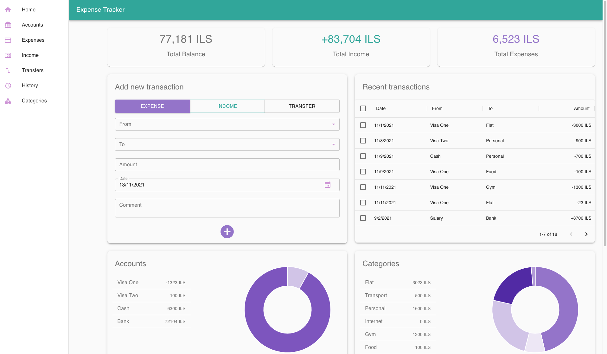
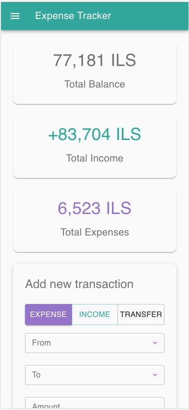
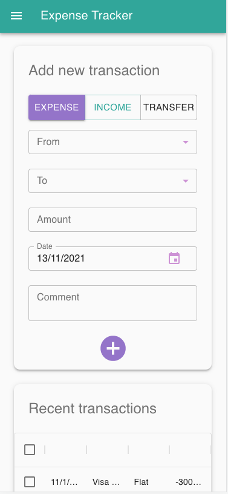
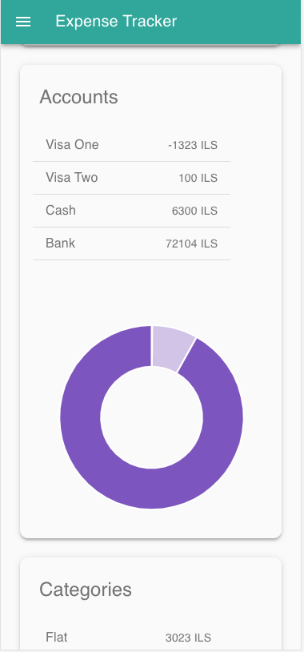
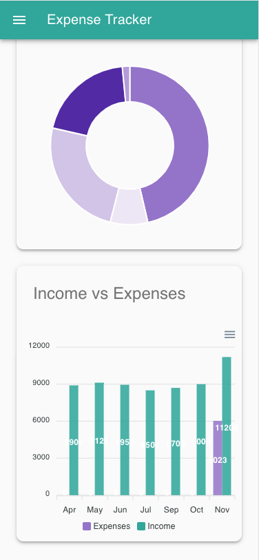

# Expense Tracker

An app to track how much money you earn, how much you spend and what you spend it on

## Stack

* React (CRA) 17
* Material-UI 4.12
* Firebase
* ApexCharts 3.28

## Description
Listed below you can find all the actions you are able to perform in this app:
### Accounts page
* Create new account (you can choose from the following categories: Bank account/Credit Card/Cash)
* Edit details of the existing account (change name/category/balance)
* Delete the account

### Categories page
* Create new expense category (on what you spend money: food, home, transport, etc...)
* Edit details of the category (change name/balance)
* Delete the category

### Expenses page
* Create new expense transaction (you can choose from multiple bank accounts/categories, choose the date, amount and add the comment if necessary)
* Edit details of the existing transaction
* Delete the transaction

### Income page

#### Desktop view

* Create new income transaction (From: simply write down where this money comes from, e.g. Salary)
* Edit details of the existing transaction
* Delete the transaction

### Transfers page
Transfer transaction is when you "transfer" money between your bank accounts, credit cards or cash it out
* Create new transfer transaction
* Edit details of the existing transaction
* Delete the transaction

### History page
Lists all the transactions of all three types (expense/income/transfer)
* Edit details of the existing transaction
* Delete the transaction

### Home page

#### Desktop view

#### Mobile view

Summarizes all the previous information
* Total Balance: total amount on your Accounts
* Total Expenses: total of how much you spent
* Total Income: total of how much you earned

On home page you can:
* edit/delete history
* add new transaction
